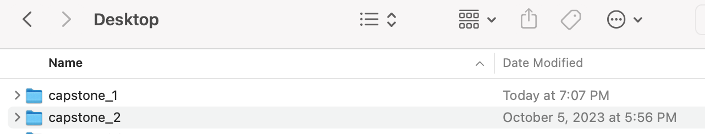
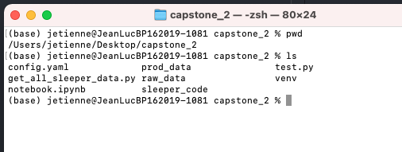

#  Intro

Let's get it, time to do player data. This happens in the real world as well, the exec wants _more data_. More detailed _insights_.


Team data isn't good enough? No fear we can do player data. And the numbers match one-to-one across data sources. Everything ties out if we do this well.

How about we clone that `capstone_1` folder. We'll rename it `capstone_2`




You know the drill. Into the terminal we go. Enter the folder

```
cd 
cd Desktop
cd capstone_2
```

Print the working directory and list the files in the folde. It looks just how we left it.

```
pwd
ls
```




Sweet. Launch VSCode

```
code .
```