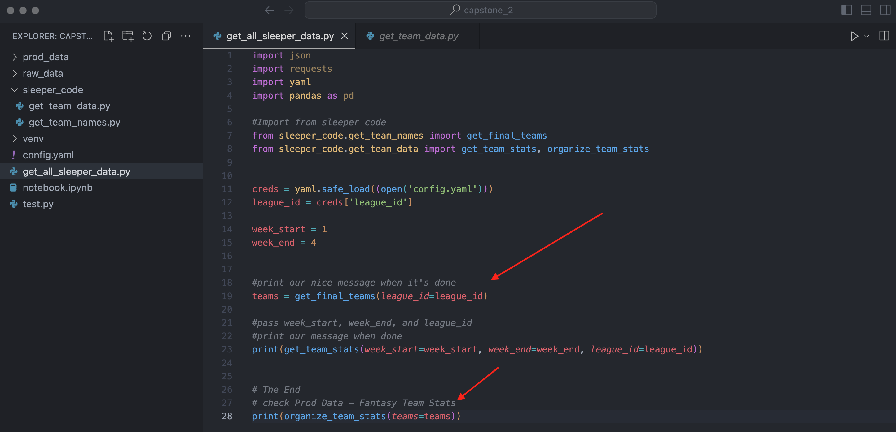
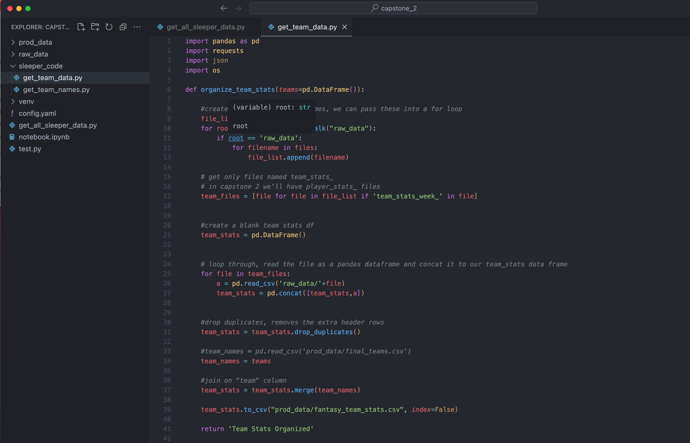
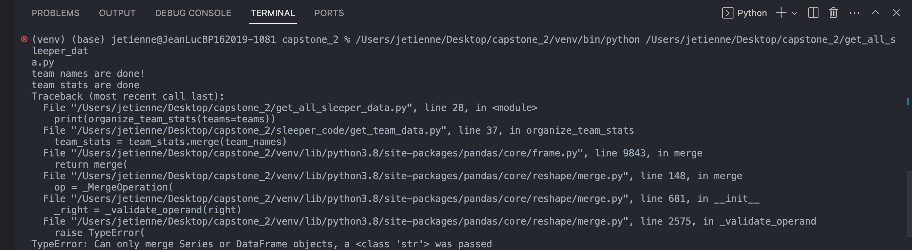
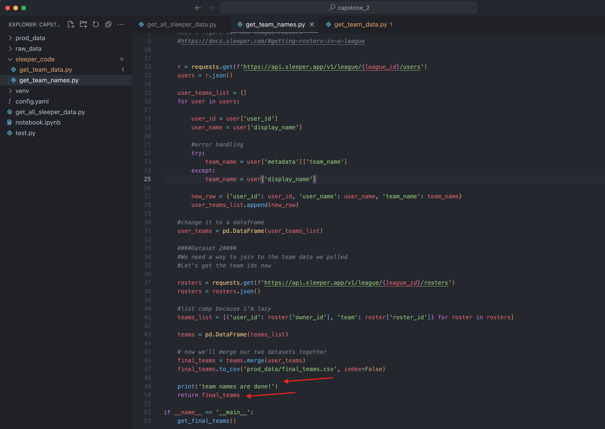
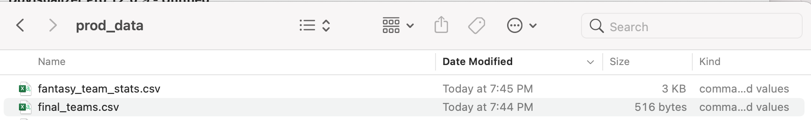

# Quick Cleanup


So by now you can pass strings, numbers, and lists into fucntions. Let's see what else can we pass.

Question: Can we pass our pandas dataframe?

Let's try that real quick.

### Changing Get All Sleeper Data

Modify get `get_all_sleeper_data.py` lines 19 and 28. On line set 

```
teams = get_final_teams()
```

And then we'll add parameter into line 28 to pull in teams




### Changing Get Teams Data

Let's alter `sleeper_code\get_team_data.py`


- Pass the df object into the function on line 6
- Comment out line and add line 34

I didn't put arrows this time, good luck!



 Let's run `get_all_sleeper_data.py`. If you get an error just read the commands and take it slow, one line at a time. Also Josh Prock is a good person to let know if it fails/succeeds. He's very invested in your growth.


### It failed!!!! Is okay we can debug



Hey jk it failed. `teams` is not defined. We need to return that dataframe in `sleeper_code\get_team_names.py`. Actually a normal problem fix one bug, create 10 more! Let's go one line of code at a time.

Okay I put the arrows back. Lines 49 and 50. Follow along let's go.



Uno mas, we can run `get_all_sleeper_data.py`

It worked on my machine! If you followed the previous step, you should've told Josh it failed. Tell him again never mind it succeeded!

### Check 1

Okay you should have a more recent date now! It has a date modified of today's date and timestamp!


Things are going smoothly. One line at a time! It's not too bad


### Result

Answer: Yeah we can pass pandas dataframes as well. We can pass whatever _objects_ we want!

### Check 2

If you want to check, add something to check type teams
Note: I didn't verify this, so if there's a typo use that big brain and fix it.

```
print(type(teams))
```