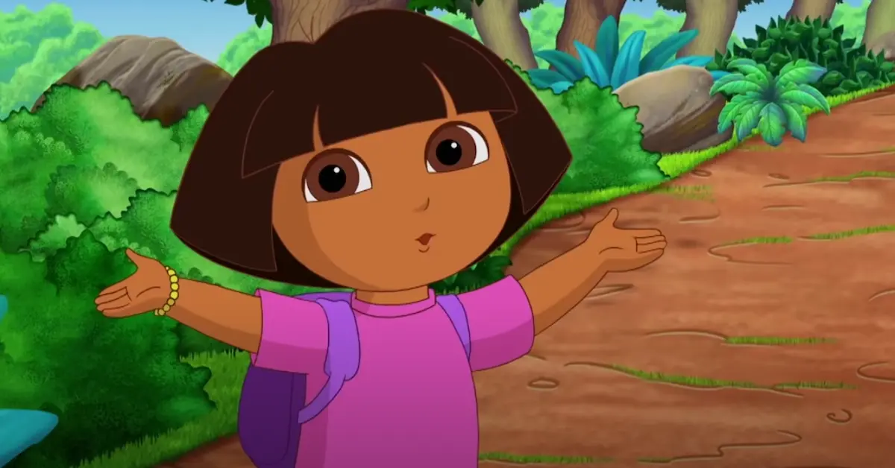
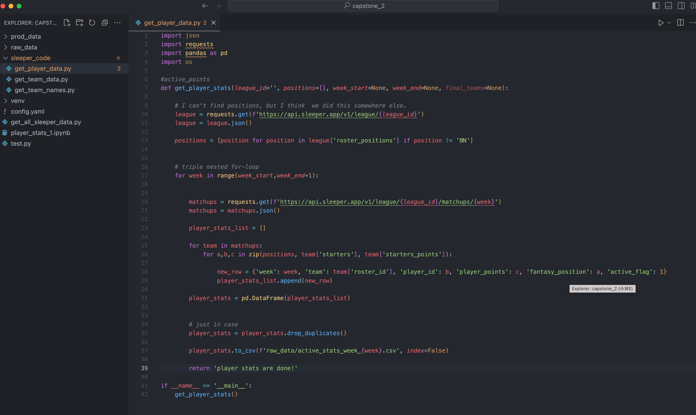
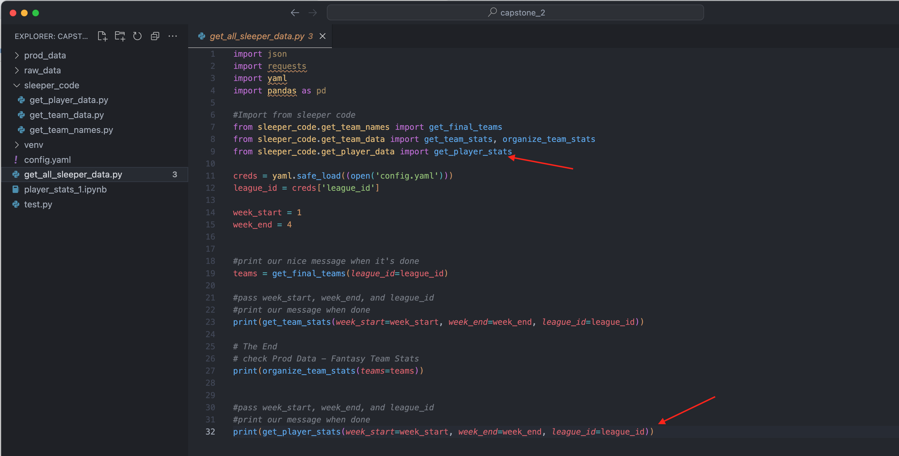
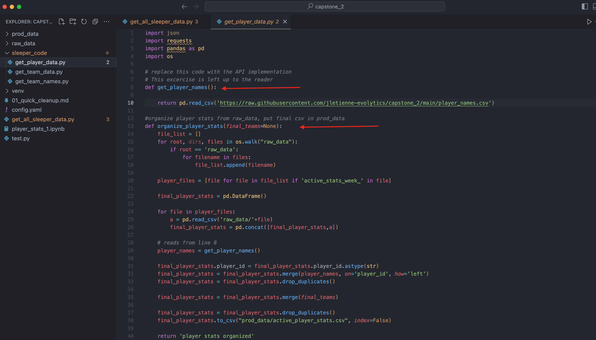
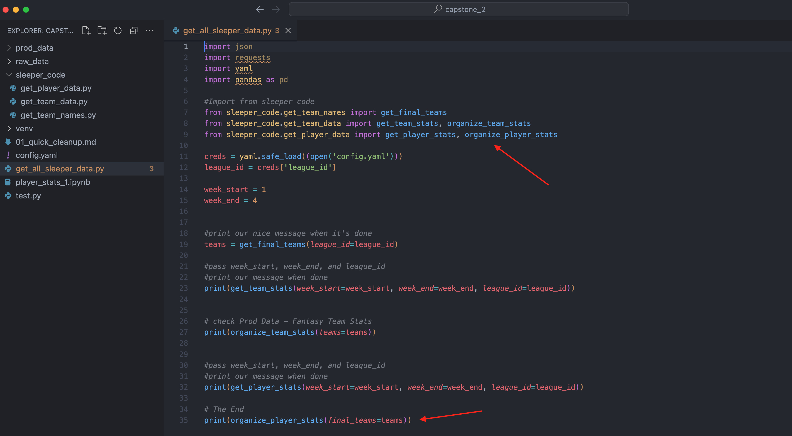

# Player Stats Scaling

Okay let's get this player stuff ready for prod. 

Dora the Explorer Voice: Can you guess the next step?



(akwardly staring at the screen breaking the fourth wall)

That's right we need to create a file called `sleeper_code/get_player_data.py`


How does this look?




And we'll update `sleeper_code/get_all_player_stats.py`




### Cool it runs!

Nice job!


### One more fix

Okay let's organize player stats. For now get player_names from this url

```
https://raw.githubusercontent.com/jletienne-evolytics/capstone_2/main/player_names.csv
```



And one last update to get all player data!


