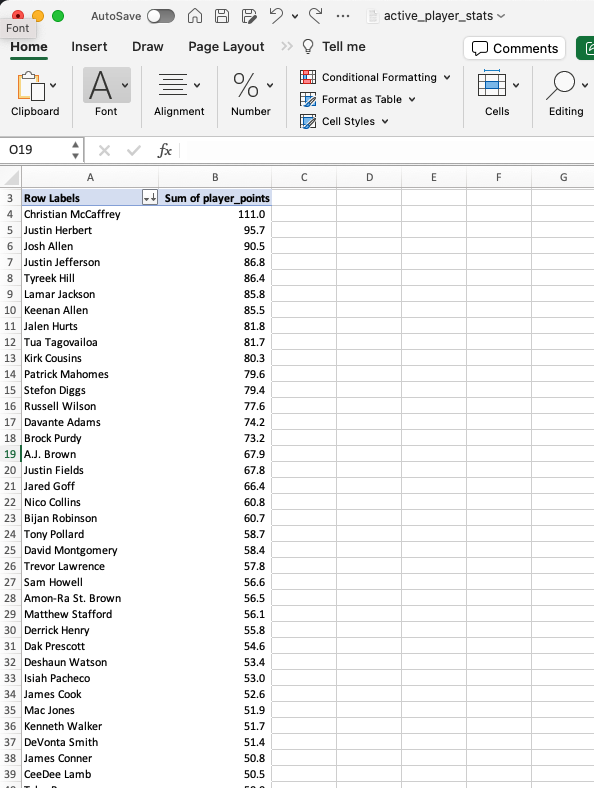

# Bonus

Okay we have all this data what do we do? Open up Tableau Public? I mean you could but let's check excel. 

Maybe pivot some data. And what did we learn.

Two capstones later. Christian McCaffrey is the best player in fantasy football. 

We hope you enjoyed this session of Python Training. Please submit your feedback to the team leads
